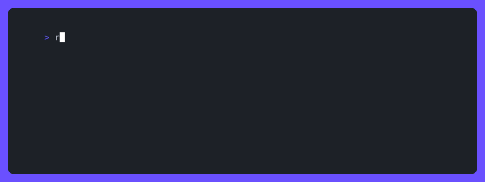
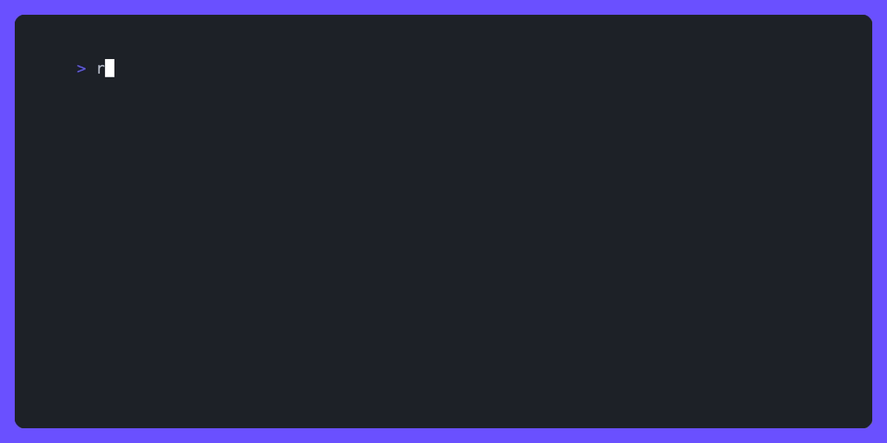

# 📦 Refit - Dependency Manager

> [!NOTE]  
> Highlights information that users should take into account, even when skimming.

> [!TIP]
> Optional information to help a user be more successful.

> [!IMPORTANT]  
> Crucial information necessary for users to succeed.

> [!WARNING]  
> Critical content demanding immediate user attention due to potential risks.

> [!CAUTION]
> Negative potential consequences of an action.

<!-- [](https://www.npmjs.com/package/refit)
[](https://www.npmjs.com/package/refit)
 -->

A CLI tool for reviewing, adding, updating, and viewing the changelog for dependencies in your Node.js project.

**🛠️ Package Managers**: Works with `npm`, `yarn`, and `pnpm`.

**🚀 Monorepo Support**: Manage all the dependencies in your monorepo with ease.

**🔥 Interactive**: Interactively bulk update dependencies or manage them individually in detail.

**🧙 Wizard:** Provides a step by step interactive wizard for full control over managing your dependencies in your project and monorepo workspaces.

**📜 Changelogs**: View changelogs for dependencies, even during interactive mode, so you never have to leave your terminal making dependency updates more efficient.

## Installation

```bash
npm install -g refit
```

Or run with npx:

```bash
npx refit
```

> ![NOTE]
> Requires Node.js 18+

## Usage

### List

List the dependencies in your project. By default, only dependencies that need to be updated are shown and are grouped by semver update type.

```bash
refit [options]

# or
refit ls [options]

```



| Option                    | Type [choices]                    | Default | Description                                     |
| ------------------------- | --------------------------------- | ------- | ----------------------------------------------- |
| `--all` , `-a`            | boolean                           | false   | show all dependencies including up to date ones |
| `--deprecated`            | boolean                           | false   | allow updating to deprecated versions           |
| `--depTypes` , `-d`       | array [`dev`, `prod`, `optional`] |         | filter by dependency type                       |
| `--global` , `-g`         | boolean                           | false   | check global node modules instead of local ones |
| `--groupByPackage` , `-G` | boolean                           | false   | list dependencies grouped by package            |
| `--noIssues` , `-n`       | boolean                           | false   | hide issues section from list output            |
| `--prerelease`            | boolean                           | false   | allow updating to prerelease versions           |
| `--sort`                  | string [`name`, `date`, `type`]   | type    | sort dependencies                               |
| `--updateTo` , `-to`      | string [`latest`, `wanted`]       | latest  | update dependencies to semver type              |
| `--semver` , `-s`         | array [`major`, `minor`, `patch`] |         | filter by update type                           |
| `--verbose` , `-v`        | boolean                           | false   | display all columns of dependency information   |
| `--workspace` , `-w`      | array                             |         | filter dependencies by workspace                |

### Update

```bash
refit update [...dependencies] [options]

# or
refit up [...dependencies] [options]

```


| Option                 | Type [choices]                    | Default | Description                            |
| ---------------------- | --------------------------------- | ------- | -------------------------------------- |
| `--deprecated`         | boolean                           | false   | allow updating to deprecated versions  |
| `--depTypes` , `-d`    | array [`dev`, `prod`, `optional`] |         | filter by dependency type              |
| `--interactive` , `-i` | boolean                           | false   | interactively bulk update dependencies |
| `--prerelease`         | boolean                           | false   | allow updating to prerelease versions  |
| `--updateTo` , `-to`   | string [`latest`, `wanted`]       | latest  | update dependencies to semver type     |
| `--semver` , `-s`      | array [`major`, `minor`, `patch`] |         | filter by update type                  |
| `--workspace` , `-w`   | array                             |         | filter dependencies by workspace       |

### Wizard

```bash
refit wizard [options]

# or
refit w [options]

```



| Option               | Type [choices]                    | Default | Description                           |
| -------------------- | --------------------------------- | ------- | ------------------------------------- |
| `--deprecated`       | boolean                           | false   | allow updating to deprecated versions |
| `--depTypes` , `-d`  | array [`dev`, `prod`, `optional`] |         | filter by dependency type             |
| `--prerelease`       | boolean                           | false   | allow updating to prerelease versions |
| `--workspace` , `-w` | array                             |         | filter dependencies by workspace      |

### Changelogs

```bash
refit changes [dependency] [options]

```


| Option          | Type [choices] | Default | Description         |
| --------------- | -------------- | ------- | ------------------- |
| `--full` , `-f` | boolean        | false   | show full changelog |

### Global Options

These options can be used with any command:

| Option             | Type [choices]                 | Default | Description                            |
| ------------------ | ------------------------------ | ------- | -------------------------------------- |
| `--packageManager` | string [`npm`, `yarn`, `pnpm`] | npm     | package manager to use                 |
| `--workspaces`     | array                          |         | directories of the monorepo workspaces |

## Configuration File

Refit supports a configuration file in the root of your project called `.refitrc.json`. This file can be used to set default options for the CLI tool. All command options and global options can be set in the configuration file.
